# Deploying the Neighborly App with Azure Functions

# RUBRIC

## Serverless Functions

### A MongoDB database in Azure CosmosDB service is created and initialized with the sample data provided.

Students should be able to create a MongoDB database, two collections, and import raw data into the database. The MongoDB database is hosted in Azure CosmosDB.

To pass this criteria, you can provide a screenshot from the Azure portal showing the database & collections, as well as confirmation that the two pieces of sample data for advertisements (5 documents) and posts (4 documents) were imported correctly.

A screenshot from the Azure portal showing the database & collections


5 documents in the collection `advertisements`.


4 documents in the collection `posts`.

A screenshot from the terminal giving confirmation that the two pieces of sample data for advertisements (5 documents) and posts (4 documents) were imported correctly, or include this data in the live website.


mongoimport succesfully imported the advertisements.


mongoimport succesfully imported the posts.

### The finished server-side application contains working Azure Functions for HTTP Triggers in Python.

Students are expected to deploy 7 endpoints: createAdvertisement, updateAdvertisement, getAdvertisement, getAdvertisements, and deleteAdvertisement, getPost, getPosts. There should be 7 urls with the format:

https:// < STUDENT-APP-NAME > .azurewebsites.net/api/ < endpoint >

To pass this criteria, show a screenshot, including URL, from the Azure portal where it is shown what endpoints are live.

A screenshot, including URL, from the Azure portal where it is shown what endpoints are live.

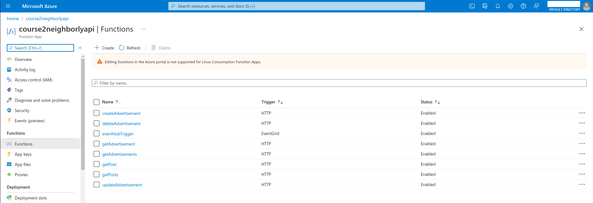

The Function App `course2neighborlyapi` offers the following functions:

https://course2neighborlyapi.azurewebsites.net/api/createAdvertisement
https://course2neighborlyapi.azurewebsites.net/api/deleteAdvertisement
https://course2neighborlyapi.azurewebsites.net/api/eventHubTrigger
https://course2neighborlyapi.azurewebsites.net/api/getAdvertisement
https://course2neighborlyapi.azurewebsites.net/api/getAdvertisements
https://course2neighborlyapi.azurewebsites.net/api/getPost
https://course2neighborlyapi.azurewebsites.net/api/getPosts
https://course2neighborlyapi.azurewebsites.net/api/updateAdvertisement

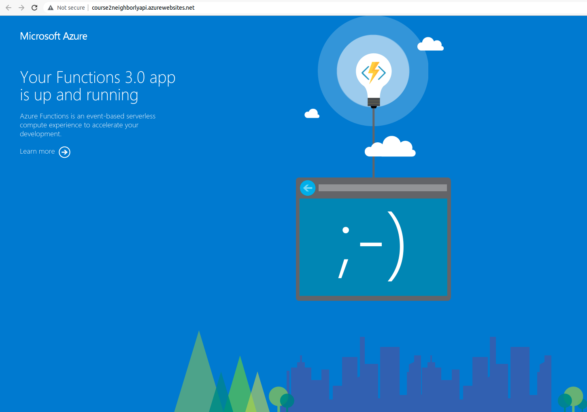

https://course2neighborlyapi.azurewebsites.net/

### The Azure Functions HTTP Trigger endpoints can connect to MongoDB in Azure CosmosDB service.

To verify that the database is configured, the student should be able to retrieve the connection on each of their API endpoints in the server-API application.

To pass this criteria, show a screenshot, including URL, of at least the data returned from querying the getAdvertisements endpoint; other endpoints will be checked for reasonableness within the related code files.

A screenshot, including URL, of at least the data returned from querying the getAdvertisements endpoint; other endpoints will be checked for reasonableness within the related code files.

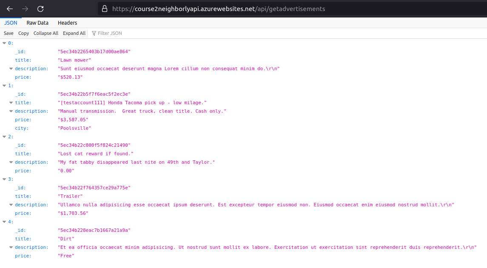

https://course2neighborlyapi.azurewebsites.net/api/getAdvertisements

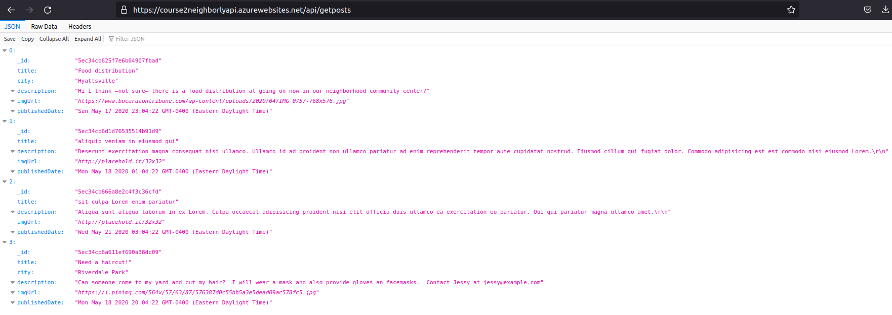

https://course2neighborlyapi.azurewebsites.net/api/getPosts

### The client-side application in Flask should be able to call the live Functions API endpoints that the students published in previous steps.

The client-side python Flask application has the routes to obtain services created by server-side Azure Functions endpoints. The student can run the client-side application on localhost:5000 and on the home page, and should be able to view the feed of advertisements and posts.

* Update the front-end code to appropriately query your published API
* Provide a screenshot here of the front-end appropriately pulling up posts when you visit localhost. Note that if you have provided a screenshot or URL to a live site with the front-end later on in the assignment, that can also be used as proof here.

A screenshot of the front-end appropriately pulling up posts when you visit localhost. Note that if you have provided a screenshot or URL to a live site with the front-end later on in the assignment, that can also be used as proof here.

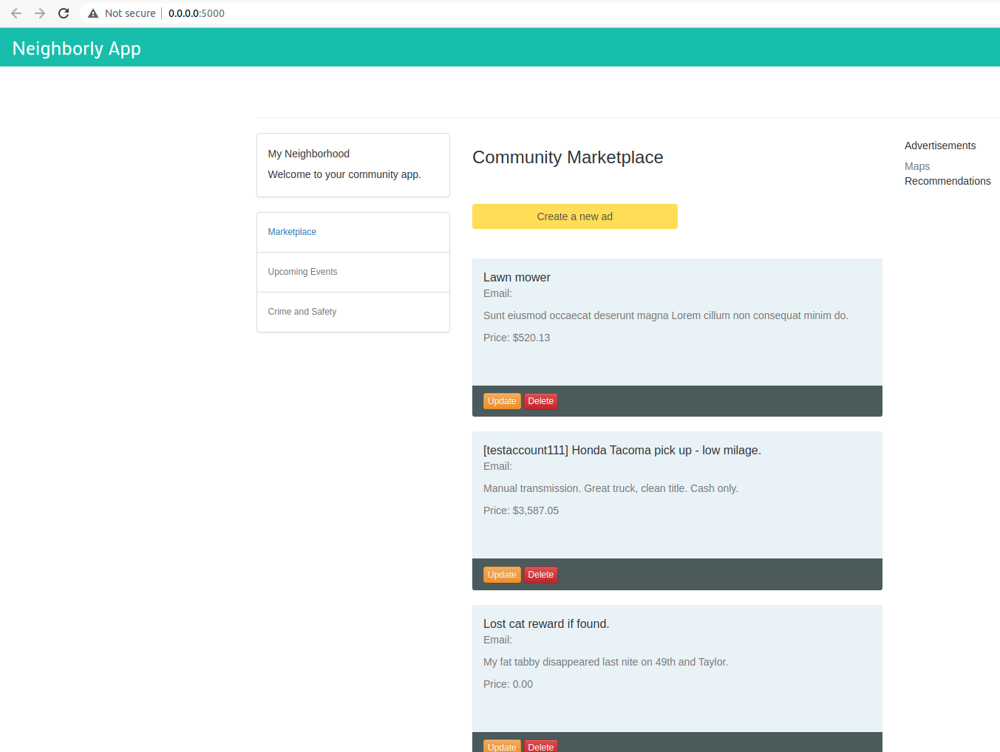

## Logic Apps & Event Hubs

### The student demonstrates mastery in using Azure Logic App Designer to create a trigger.

Students should be able to create a Logic App that watches for an HTTP trigger. When the HTTP request is triggered, the student is sent an email (with Gmail) notification. The student can validate this by a screenshot of their inbox.

A screenshot from your inbox notification.


The API Keys from the Send Grid website.

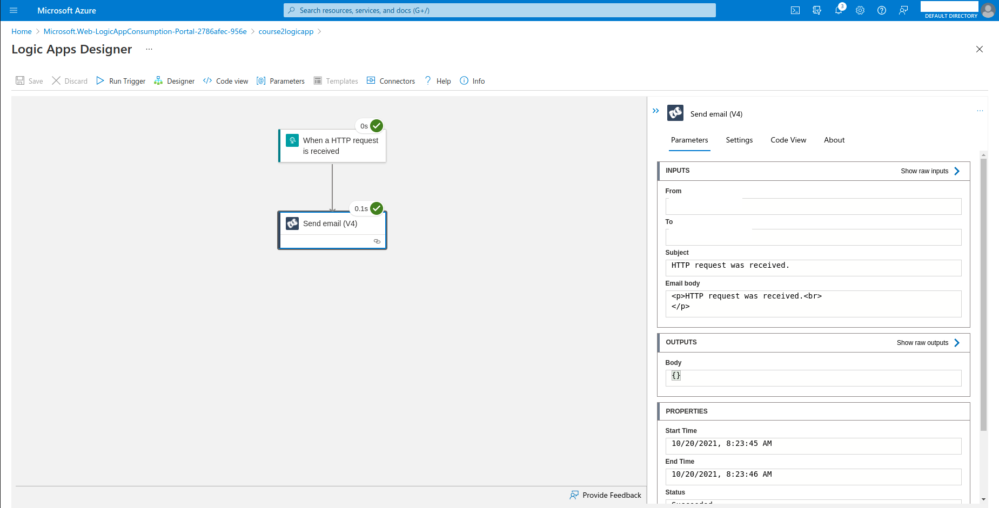

The Logic App which is triggered by an HTTP Request and sends an e-mail.


The e-mail received.

### The student should be able to create a custom event grid topic and publish the topic.

The student should be able create an Event Hubs namespace and an event hub with the command line or through the portal. If successful, the student can obtain the namespace url. Add a screenshot from the portal of this being live.

A screenshot with the namespace URL.

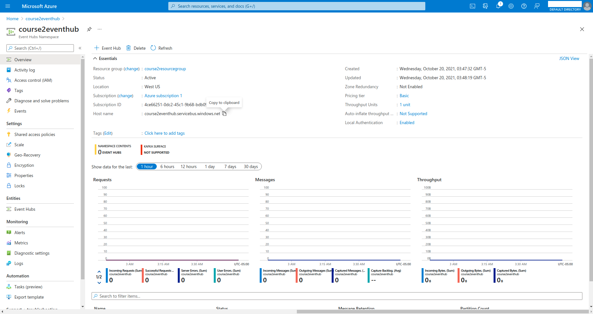

I created the Event Hub Namespace `course2eventhub`.

Here is the Event Hub Namespace URL: https://course2eventhub.servicebus.windows.net **(Disabled to save money.)**

### The student should be able to add the connection string of the event hub to the Azure Function.

The student should be able to use the endpoint connection string from the event hub to the eventHubTrigger function in the function.json file.


In the eventHubTrigger of the Function App `course2neighborlyapi`, I edited the Event Grid Trigger and I created an Event Subscription for the Event Hub Namespace `course2eventhub`.

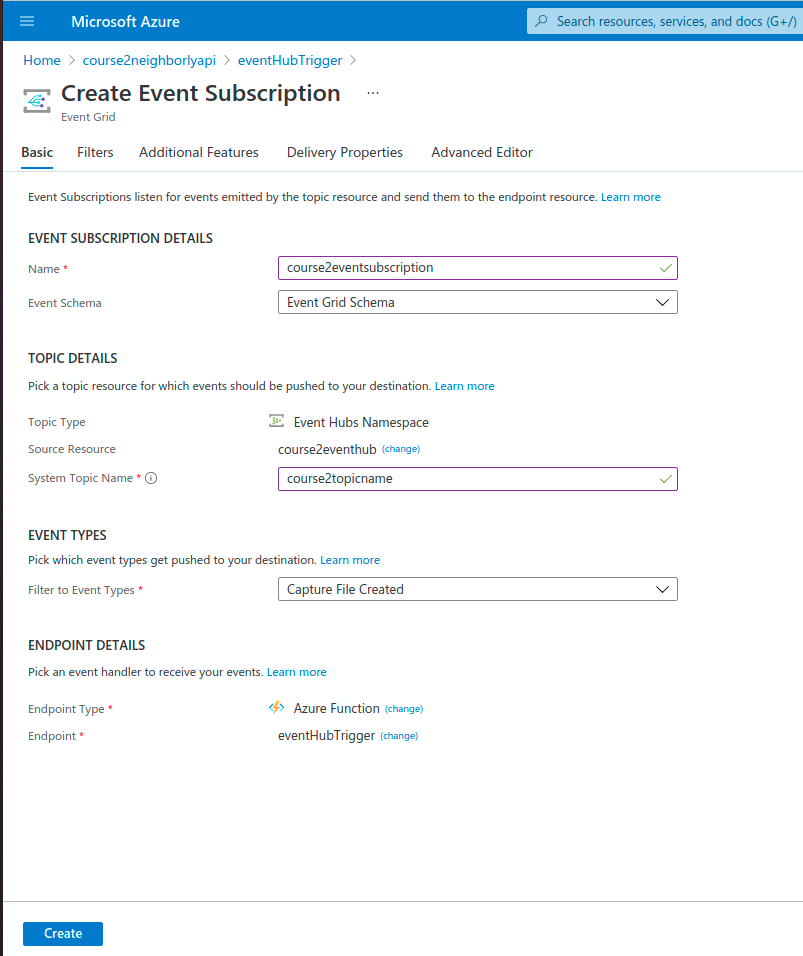

## Deploying Your Application

### The student should be able to deploy their Neighborly web application on Azure App Service.

The student should be able to use the live url from Azure App Service in their browser. The URL should be accessible to all users on the World Wide Web, or a screenshot should be provided, including the URL, of the live site.

The live url from Azure App Service (which should be accessible to all users on the World Wide Web), or a screenshot should be provided, including the URL, of the previously live site.

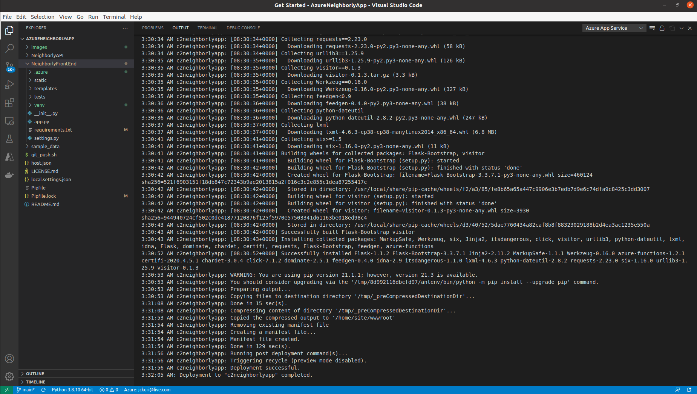

I deployed the Web App through Visual Studio because the Azure CLI didn't work.

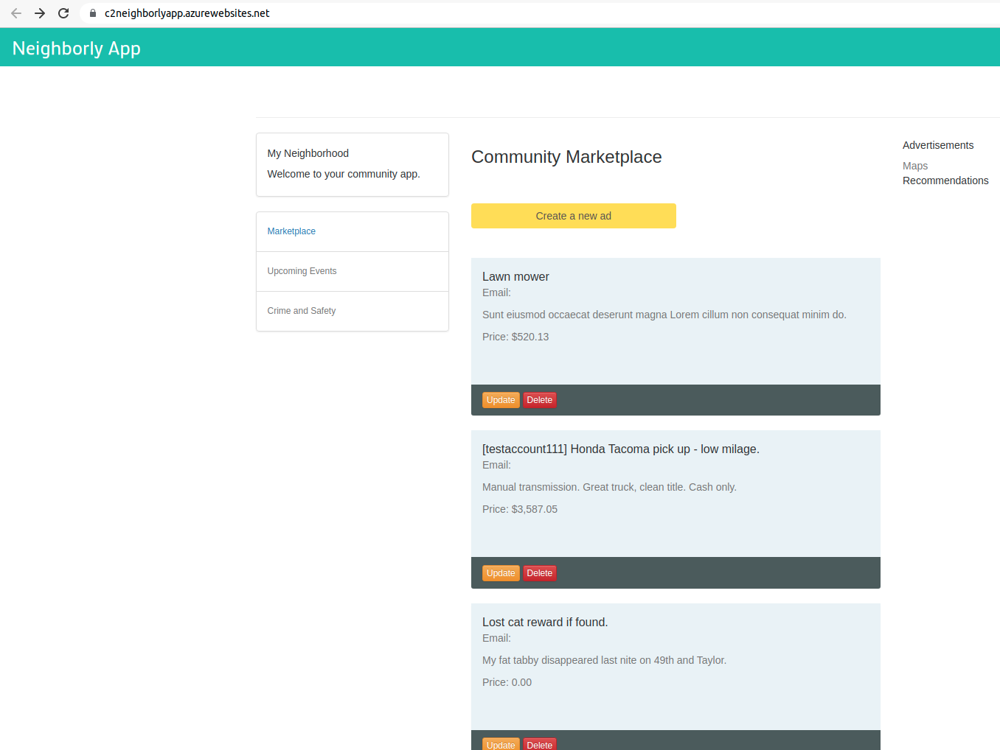

And here is the Web App in this link: https://c2neighborlyapp.azurewebsites.net/

### The student should be able to containerize their Flask application with Dockerfile.

The student can run docker build and can import their Dockerfile in the Azure Container Registry.

Provide a screenshot of the Dockerfile from Azure Container Registry as evidence.

A screenshot of the Dockerfile from Azure Container Registry as evidence.

```
RESOURCE_GROUP="course2resourcegroup"
APP_REGISTRY="project2appregistry"

az acr create --resource-group $RESOURCE_GROUP --name $APP_REGISTRY --sku Basic

APP_REGISTRY_LINK="$APP_REGISTRY.azurecr.io"
echo $APP_REGISTRY_LINK
docker login $APP_REGISTRY_LINK

func init --docker-only --python

DOCKER_IMAGE="project2dockerimage"
docker build . -t $DOCKER_IMAGE

docker run -p 8080:80 -it $DOCKER_IMAGE

docker tag $DOCKER_IMAGE $APP_REGISTRY_LINK/$DOCKER_IMAGE

az acr login --name $APP_REGISTRY

docker push $APP_REGISTRY_LINK/$DOCKER_IMAGE
```

I used these commands to create a Docker image and push it to the Azure Container Registry.


Here is the evidence that the Docker image was successfully pushed to the Azure Container Registry.

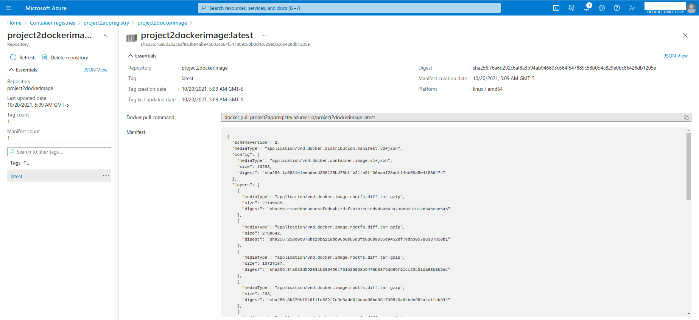

### The code demonstrates an automated pipeline to spin Kubernetes services in Azure.

The student should be able to create a cluster with the one node.

Provide a screenshot of confirmation from the terminal, or from within Azure, as evidence.

A screenshot of confirmation from the terminal, or from within Azure, as evidence.

```
K8SC="project2kubernetescluster"
az aks create \
 --resource-group $RESOURCE_GROUP \
 --name $K8SC \
 --node-count 1 \
 --generate-ssh-keys
 
 
# ERR_CONNECTION_TIMED_OUT accessing kubernetes deployment for Exercise "Containerizing Your App for AKS Deployment"
# https://knowledge.udacity.com/questions/613679

az aks update -n $K8SC -g $RESOURCE_GROUP --attach-acr $APP_REGISTRY


# Get credentials
az aks get-credentials --name $K8SC --resource-group $RESOURCE_GROUP


# https://docs.microsoft.com/en-us/azure/azure-functions/functions-kubernetes-keda#deploying-a-function-app-to-kubernetes

func kubernetes deploy --name $K8SC --image-name $APP_REGISTRY_LINK/$DOCKER_IMAGE:latest --polling-interval 3 --cooldown-period 5 --ignore-errors


kubectl config get-contexts
```

I used these commands to create a Kubernetes service, associate it with the Docker image in the Azure Container Registry, and finally deploy the Kubernetes service.


Here is the evidence that the Kubernetes service was successfully deployed.

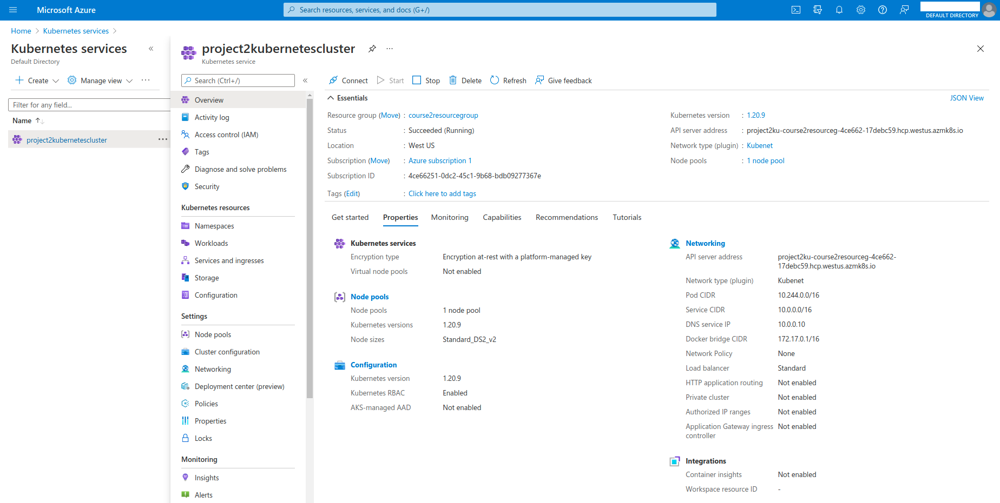

And here is the proof that the web services deployed in the Kubernetes cluster actually work:

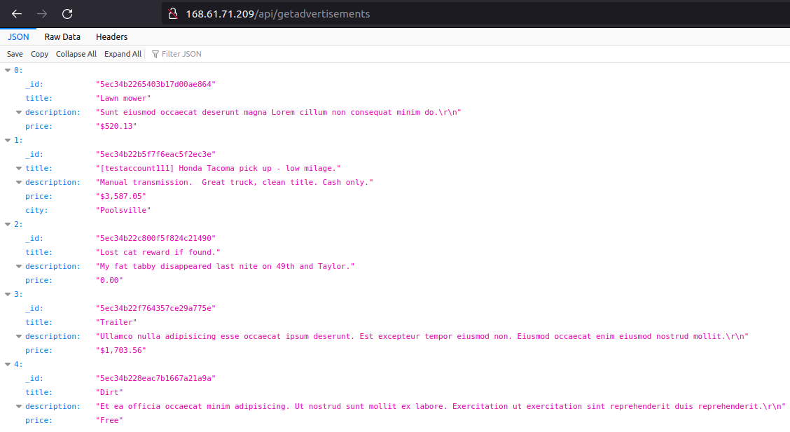

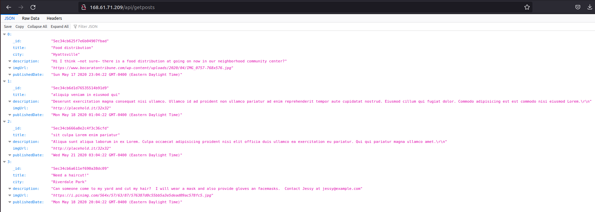

--------------------------------------------------------------------------------
--------------------------------------------------------------------------------

# Deploying the Neighborly App with Azure Functions

## Project Overview

For the final project, we are going to build an app called "Neighborly". Neighborly is a Python Flask-powered web application that allows neighbors to post advertisements for services and products they can offer.

The Neighborly project is comprised of a front-end application that is built with the Python Flask micro framework. The application allows the user to view, create, edit, and delete the community advertisements.

The application makes direct requests to the back-end API endpoints. These are endpoints that we will also build for the server-side of the application.

You can see an example of the deployed app below.


## Dependencies

You will need to install the following locally:

- [Pipenv](https://pypi.org/project/pipenv/)
- [Visual Studio Code](https://code.visualstudio.com/download)
- [Azure Function tools V3](https://docs.microsoft.com/en-us/azure/azure-functions/functions-run-local?tabs=windows%2Ccsharp%2Cbash#install-the-azure-functions-core-tools)
- [Azure CLI](https://docs.microsoft.com/en-us/cli/azure/install-azure-cli?view=azure-cli-latest)
- [Azure Tools for Visual Studio Code](https://marketplace.visualstudio.com/items?itemName=ms-vscode.vscode-node-azure-pack)

On Mac, you can do this with:

```bash
# install pipenv
brew install pipenv

# install azure-cli
brew update && brew install azure-cli

# install azure function core tools 
brew tap azure/functions
brew install azure-functions-core-tools@3
```

## Project Instructions

In case you need to return to the project later on, it is suggested to store any commands you use so you can re-create your work. You should also take a look at the project rubric to be aware of any places you may need to take screenshots as proof of your work (or else keep your resource up and running until you have passed, which may incur costs).

### I. Creating Azure Function App

We need to set up the Azure resource group, region, storage account, and an app name before we can publish.

1. Create a resource group.
2. Create a storage account (within the previously created resource group and region).
3. Create an Azure Function App within the resource group, region and storage account. 
   - Note that app names need to be unique across all of Azure.
   - Make sure it is a Linux app, with a Python runtime.

    Example of successful output, if creating the app `myneighborlyapiv1`:

    ```bash
    Your Linux function app 'myneighborlyapiv1', that uses a consumption plan has been successfully created but is not active until content is published using Azure Portal or the Functions Core Tools.
    ```

4. Set up a Cosmos DB Account. You will need to use the same resource group, region and storage account, but can name the Cosmos DB account as you prefer. **Note:** This step may take a little while to complete (15-20 minutes in some cases).

5. Create a MongoDB Database in CosmosDB Azure and two collections, one for `advertisements` and one for `posts`.
6. Print out your connection string or get it from the Azure Portal. Copy/paste the **primary connection** string.  You will use it later in your application.

    Example connection string output:
    ```bash
    bash-3.2$ Listing connection strings from COSMOS_ACCOUNT:
    + az cosmosdb keys list -n neighborlycosmos -g neighborlyapp --type connection-strings
    {
    "connectionStrings": [
        {
        "connectionString": "AccountEndpoint=https://neighborlycosmos.documents.azure.com:443/;AccountKey=xxxxxxxxxxxx;",
        "description": "Primary SQL Connection String"
        },
        {
        "connectionString": "AccountEndpoint=https://neighborlycosmos.documents.azure.com:443/;AccountKey=xxxxxxxxxxxxx;",
        "description": "Secondary SQL Connection String"
        } 
        
        ... [other code omitted]
    ]
    }
    ```

7. Import Sample Data Into MongoDB.
   - Download dependencies:
        ```bash
        # get the mongodb library
        brew install mongodb-community@4.2

        # check if mongoimport lib exists
        mongoimport --version
        ```

    - Import the data from the `sample_data` directory for Ads and Posts to initially fill your app.

        Example successful import:
        ```
        Importing ads data ------------------->
        2020-05-18T23:30:39.018-0400  connected to: mongodb://neighborlyapp.mongo.cosmos.azure.com:10255/
        2020-05-18T23:30:40.344-0400  5 document(s) imported successfully. 0 document(s) failed to import.
        ...
        Importing posts data ------------------->
        2020-05-18T23:30:40.933-0400  connected to: mongodb://neighborlyapp.mongo.cosmos.azure.com:10255/
        2020-05-18T23:30:42.260-0400  4 document(s) imported successfully. 0 document(s) failed to import.
        ```

8. Hook up your connection string into the NeighborlyAPI server folder. You will need to replace the *url* variable with your own connection string you copy-and-pasted in the last step, along with some additional information.
    - Tip: Check out [this post](https://docs.microsoft.com/en-us/azure/cosmos-db/connect-mongodb-account) if you need help with what information is needed.
    - Go to each of the `__init__.py` files in getPosts, getPost, getAdvertisements, getAdvertisement, deleteAdvertisement, updateAdvertisement, createAdvertisements and replace your connection string. You will also need to set the related `database` and `collection` appropriately.

    ```bash
    # inside getAdvertisements/__init__.py

    def main(req: func.HttpRequest) -> func.HttpResponse:
        logging.info('Python getAdvertisements trigger function processed a request.')

        try:
            # copy/paste your primary connection url here
            #-------------------------------------------
            url = ""
            #--------------------------------------------

            client=pymongo.MongoClient(url)

            database = None # Feed the correct key for the database name to the client
            collection = None # Feed the correct key for the collection name to the database

            ... [other code omitted]
            
    ```

    Make sure to do the same step for the other 6 HTTP Trigger functions.

9. Deploy your Azure Functions.

    1. Test it out locally first.

        ```bash
        # cd into NeighborlyAPI
        cd NeighborlyAPI

        # install dependencies
        pipenv install

        # go into the shell
        pipenv shell

        # test func locally
        func start
        ```

        You may need to change `"IsEncrypted"` to `false` in `local.settings.json` if this fails.

        At this point, Azure functions are hosted in localhost:7071.  You can use the browser or Postman to see if the GET request works.  For example, go to the browser and type in: 

        ```bash
        # example endpoint for all advertisements
        http://localhost:7071/api/getadvertisements

        #example endpoint for all posts
        http://localhost:7071/api/getposts
        ```

    2. Now you can deploy functions to Azure by publishing your function app.

        The result may give you a live url in this format, or you can check in Azure portal for these as well:

        Expected output if deployed successfully:
        ```bash
        Functions in <APP_NAME>:
            createAdvertisement - [httpTrigger]
                Invoke url: https://<APP_NAME>.azurewebsites.net/api/createadvertisement

            deleteAdvertisement - [httpTrigger]
                Invoke url: https://<APP_NAME>.azurewebsites.net/api/deleteadvertisement

            getAdvertisement - [httpTrigger]
                Invoke url: https://<APP_NAME>.azurewebsites.net/api/getadvertisement

            getAdvertisements - [httpTrigger]
                Invoke url: https://<APP_NAME>.azurewebsites.net/api/getadvertisements

            getPost - [httpTrigger]
                Invoke url: https://<APP_NAME>.azurewebsites.net/api/getpost

            getPosts - [httpTrigger]
                Invoke url: https://<APP_NAME>.azurewebsites.net/api/getposts

            updateAdvertisement - [httpTrigger]
                Invoke url: https://<APP_NAME>.azurewebsites.net/api/updateadvertisement

        ```

        **Note:** It may take a minute or two for the endpoints to get up and running if you visit the URLs.

        Save the function app url **https://<APP_NAME>.azurewebsites.net/api/** since you will need to update that in the client-side of the application.

### II. Deploying the client-side Flask web application

We are going to update the Client-side `settings.py` with published API endpoints. First navigate to the `settings.py` file in the NeighborlyFrontEnd/ directory.

Use a text editor to update the API_URL to your published url from the last step.
```bash
# Inside file settings.py

# ------- For Local Testing -------
#API_URL = "http://localhost:7071/api"

# ------- For production -------
# where APP_NAME is your Azure Function App name 
API_URL="https://<APP_NAME>.azurewebsites.net/api"
```

### III. CI/CD Deployment

1. Deploy your client app. **Note:** Use a **different** app name here to deploy the front-end, or else you will erase your API. From within the `NeighborlyFrontEnd` directory:
    - Install dependencies with `pipenv install`
    - Go into the pip env shell with `pipenv shell`
    - Deploy your application to the app service. **Note:** It may take a minute or two for the front-end to get up and running if you visit the related URL.

    Make sure to also provide any necessary information in `settings.py` to move from localhost to your deployment.

2. Create an Azure Registry and dockerize your Azure Functions. Then, push the container to the Azure Container Registry.
3. Create a Kubernetes cluster, and verify your connection to it with `kubectl get nodes`.
4. Deploy app to Kubernetes, and check your deployment with `kubectl config get-contexts`.

### IV. Event Hubs and Logic App

1. Create a Logic App that watches for an HTTP trigger. When the HTTP request is triggered, send yourself an email notification.
2. Create a namespace for event hub in the portal. You should be able to obtain the namespace URL.
3. Add the connection string of the event hub to the Azure Function.

### V.  Cleaning Up Your Services

Before completing this step, make sure to have taken all necessary screenshots for the project! Check the rubric in the classroom to confirm.

Clean up and remove all services, or else you will incur charges.

```bash
# replace with your resource group
RESOURCE_GROUP="<YOUR-RESOURCE-GROUP>"
# run this command
az group delete --name $RESOURCE_GROUP
```
